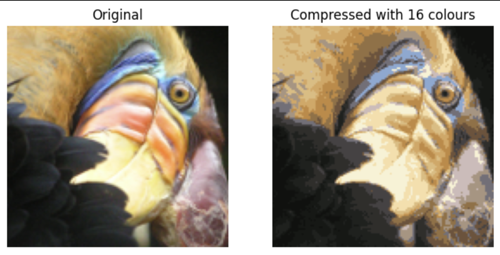

# K-means Clustering 

This repository contains an implementation of the K-means clustering algorithm using `numpy`, applied to both a sample dataset and image compression tasks.

### Project Overview
- **Objective**: Understand and implement the K-means clustering algorithm for data grouping and color reduction in images.
- **Applications**:
  - Clustering of a sample dataset to gain intuition about the algorithm.
  - **Image Compression**: Reduce the number of colors in an image by clustering and retaining only the most common colors, effectively compressing the image size.

### Key Features
- **Algorithm Explanation**: Brief overview of the K-means algorithm and its steps.
- **Dataset Clustering**: Demonstrates how K-means clusters data points based on similarity.
- **Image Compression with K-means**: Shows how K-means can compress images by reducing color complexity.

This project provides insights into how unsupervised learning methods like K-means can be applied to real-world tasks such as data clustering and image compression. [Code](./Clustering/k_means.ipynb)

### Results:
